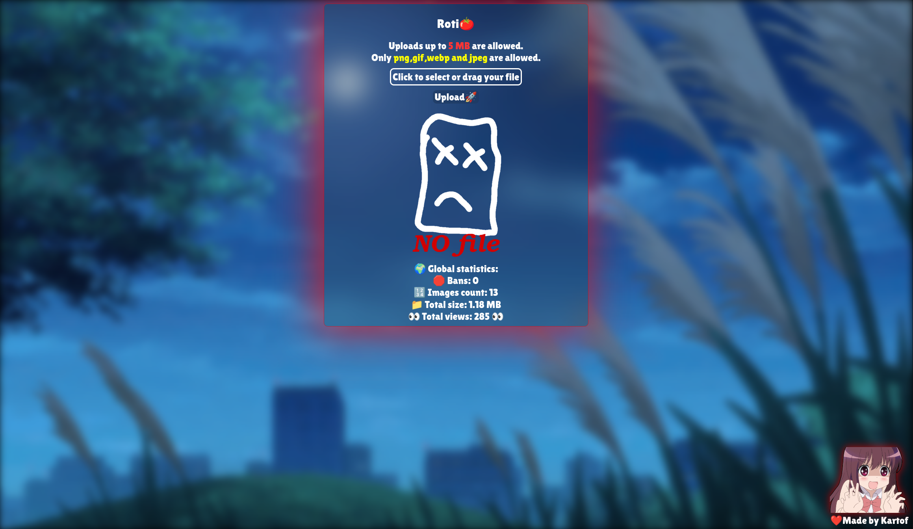
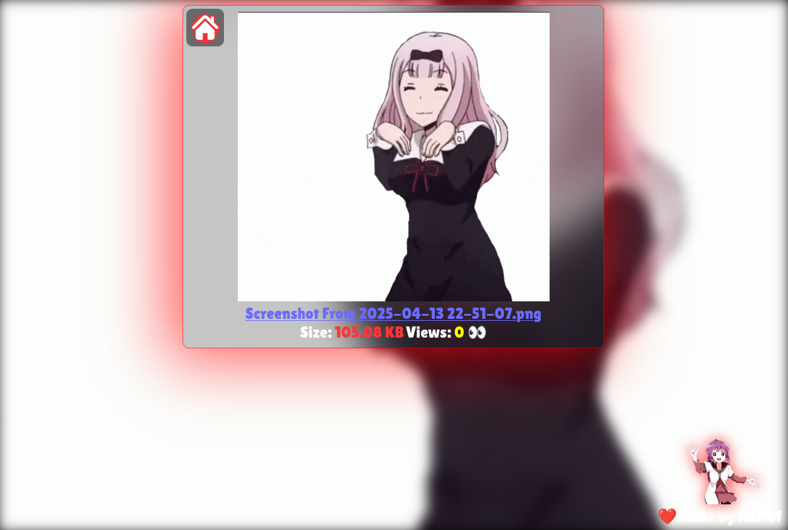

<b><h1>Roti🍅</h1></b>

<b>Roti</b> an image hosting website made with my http library [choki](https://github.com/Kartofi/choki).

A succesor to [Kartof Images](https://github.com/Kartofi/kartof-images)

 

 

## Recommended IDE Setup

- [VS Code](https://code.visualstudio.com/) + [rust-analyzer](https://marketplace.visualstudio.com/items?itemName=rust-lang.rust-analyzer)

## Configuration

Just run/build it and the default port is 3000.

## Disclaimer

<b>
I am not responsible for any illegal usages or images stored using this.
 
I do not own any images or gif's included in the project. 
